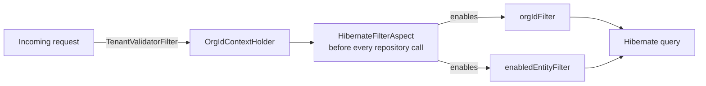

# MercadoX Library - JPA

## Overview

`mercado-x-library-jpa` is the persistence layer shared by every MercadoX microservice. It owns all Spring Data JPA repositories, the QueryDSL infrastructure, the master `schema.sql`, and — most importantly — the multi-tenancy enforcement mechanism that every other service relies on without having to think about it.

It is a library, not a service: it has no `main()` and is consumed as a Maven dependency, auto-configuring itself into whichever Spring Boot application includes it.

---

## Responsibilities

- Spring Data JPA repositories (`JpaRepository` + `QuerydslPredicateExecutor` via `BaseRepository`)
- QueryDSL infrastructure (`JPAQueryFactory`, generated `Q*` types, predicate factories)
- Automatic, aspect-driven multi-tenant row filtering
- `DataSource` / `EntityManagerFactory` / transaction manager auto-configuration
- The canonical `schema.sql` for the whole `mercado_x` database
- H2-based integration test scaffolding for consuming services

---

## Multi-Tenant Enforcement: the Hibernate Filter Aspect

This is the module's core design decision, so it's worth explaining in detail rather than leaving it to be discovered by reading AOP pointcuts.

Every entity extends `TenantBaseEntity`, which declares a Hibernate `@FilterDef` named `orgIdFilter`. On its own, a `@FilterDef` does nothing — it has to be explicitly enabled per Hibernate `Session`, and it's easy to forget in a service method and accidentally return data across tenants.

`HibernateFilterAspect` closes that gap by intercepting **every method call into any repository** in this module (`execution(* hn.alturaforge.mercadox.library.jpa.repository..*(..))`) and enabling two filters before the query runs:

- `enabledEntityFilter` — excludes soft-deleted/disabled rows
- `orgIdFilter` — scoped to `OrgIdContextHolder.getTenantId()` (populated per-request by `TenantValidatorFilter` in `mercado-x-context`)

The result: a service author calling `itemRepository.findById(id)` gets tenant isolation automatically — there is no `WHERE org_id = ?` to remember, and no code path that silently omits it.



**Escape hatch:** some operations are legitimately cross-tenant (admin tooling, background jobs). `@DisableHibernateFilters({"orgIdFilter"})` on a method or class routes through `HibernateFilterDisablingAspect`, which temporarily disables the named filters and restores their prior state — including re-applying the current `orgId` — once the method returns.

---

## QueryDSL Infrastructure

`JpaConfig` wires the `DataSource`, `EntityManagerFactory`, and `PlatformTransactionManager` for any consuming service (gated behind `mercadox.jpa.enabled=true`, default `true`, via `@ConditionalOnProperty` — a service can opt out if it doesn't need persistence at all). `QueryDSLInfrastructureConfig` layers `JPAQueryFactory` on top and wraps it in `OrgAwareQueryFactory`, so custom repository implementations (`CustomItemRepositoryImpl`, `CustomOrderRepositoryImpl`, etc.) that need query patterns beyond derived-method or `@Query` support still go through the same tenant-aware path rather than hand-rolling `WHERE org_id = ...` per query.

---

## Repositories

| Repository | Notable behavior |
|---|---|
| `ItemRepository` | `findByIdForUpdate` — `@Lock(PESSIMISTIC_WRITE)` row lock used by `mercado-x-core` to serialize concurrent stock updates |
| `OrderRepository` / `OrderItemRepository` | Order aggregate persistence |
| `CustomItemRepository` | QueryDSL joins (e.g. `findItemWithInventory` fetch-joins `Item` + `Inventory`) |
| `CustomOrderRepository`, `CustomOrgRepository`, `CustomUserRepository`, `CustomNotificationTemplateRepository` | QueryDSL-backed queries beyond what derived methods express cleanly |
| `NotificationTemplateRepository` | Backs `mercado-x-email`'s template system |
| `UserRepository`, `OrganizationRepository`, `RoleRepository`, `CategoryRepository`, `LocationRepository`, `LeadRepository`, `ShipmentRepository`, `InventoryRepository`, `UserNotificationPreferenceRepository` | Standard CRUD + derived queries |

All repositories extend `BaseRepository<T, ID>`, which combines `JpaRepository` and `QuerydslPredicateExecutor` so every repository gets dynamic predicate support for free.

---

## Testing

Integration tests (`*IntTest`) run against a real Postgres via Testcontainers (`AbstractIntegrationTest`), exercising the actual `schema.sql` rather than a Hibernate-generated schema — this catches drift between entity mappings and the DDL that production actually runs. `H2JpaTestConfig` / `H2BaseJpaIntegrationTest` provide a lighter in-memory alternative for consuming services (e.g. `mercado-x-oauth`'s test suite) that don't need the full Testcontainers setup.

```bash
mvn test
```

---

## Configuration Reference

Consuming services must provide:

```yaml
spring:
  datasource:
    url: jdbc:postgresql://localhost:5432/mercado_x
    username: ${DB_USERNAME:postgres}
    password: ${DB_PASSWORD}
  jpa:
    hibernate:
      ddl-auto: validate   # this module never generates schema — schema.sql is the source of truth

mercadox:
  jpa:
    enabled: true   # default; set false to opt a service out of persistence entirely
```

---

## Internal Dependencies

| Module | Purpose |
|---|---|
| `mercado-x-library-entity` | Entities this module builds repositories and QueryDSL `Q*` types around |
| `mercado-x-context` | `OrgIdContextHolder` — the source of truth `HibernateFilterAspect` reads from |

---

## Used By

- `mercado-x-oauth`
- `mercado-x-core`
- `mercado-x-email`
